# Formatting Guide

Detailed examples of formatting elements supported by the GerdsenAI Document Builder.

## Code Block Examples

### Diff Block
```diff
- removed line (red text on dark background)
+ added line (green text on dark background)
  context line (gray text)
@@ -1,3 +1,4 @@ hunk header (blue text)
```

### Tree/Directory Block
```tree
project/
  src/
    main.py
    utils/
      helpers.py
  tests/
    test_main.py
  README.md
```

Directories are displayed in yellow, files in gray, tree characters (`/`, `|`, etc.) in blue.

### Shell/Terminal Block
```shell
$ pip install gerdsenai-builder
Installing collected packages: gerdsenai-builder
Successfully installed gerdsenai-builder-1.0.0
```

Green prompt (`$`), green commands, teal output on a black background.

### Python Block
```python
def build_document(path: str) -> str:
    """Build a PDF from a markdown file."""
    builder = DocumentBuilder()
    return builder.build(path)
```

### YAML Block
```yaml
config:
  page_size: A4
  margins:
    top: 25
    bottom: 25
```

### JSON Block
```json
{
  "name": "example",
  "version": "1.0.0",
  "dependencies": {}
}
```

## Mermaid Diagram Examples

### Flowchart
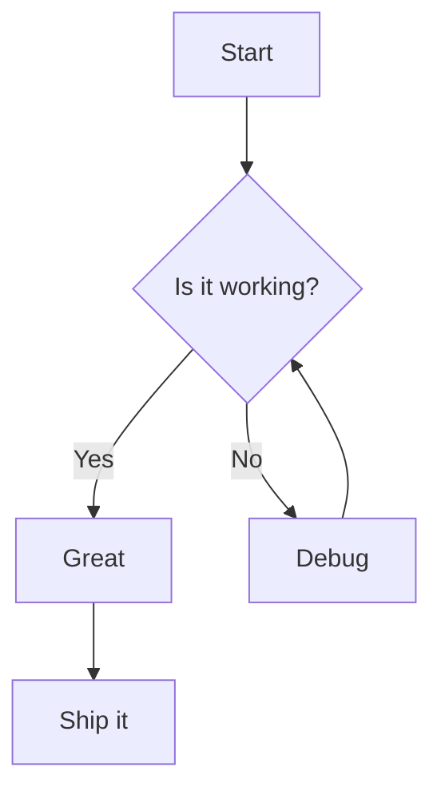

### Sequence Diagram
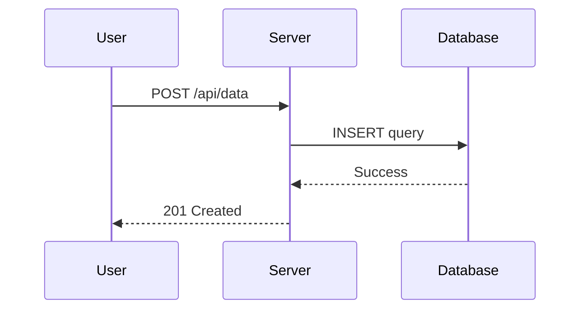

### Gantt Chart
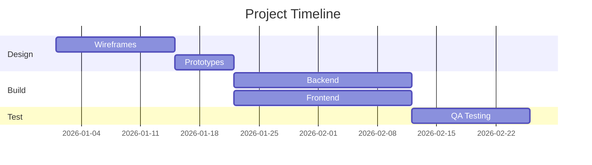

### Pie Chart
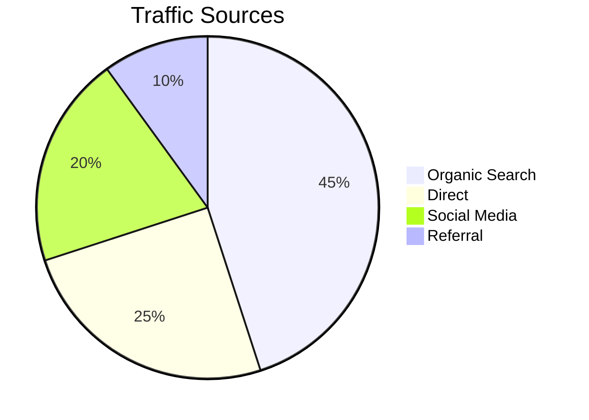

### State Diagram
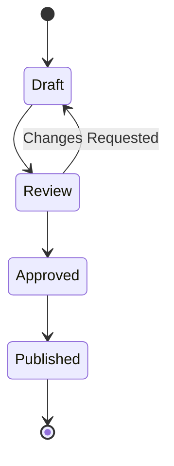

### Entity Relationship
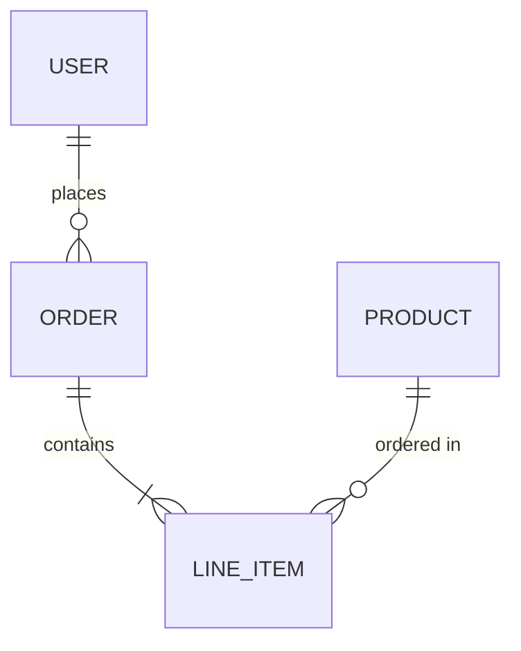

### User Journey
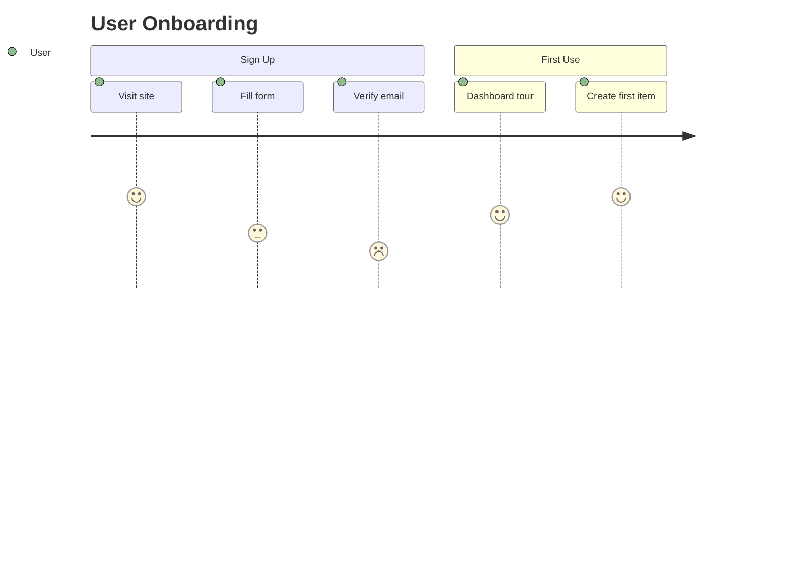

### Class Diagram
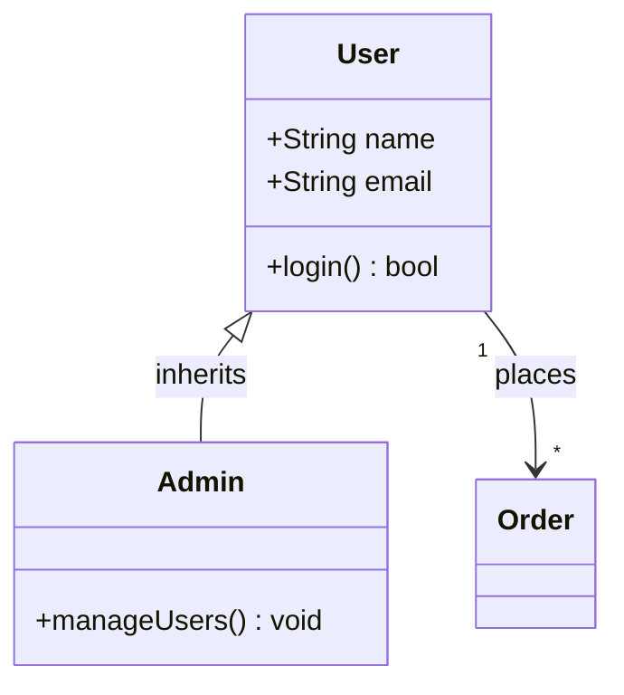

### Mindmap
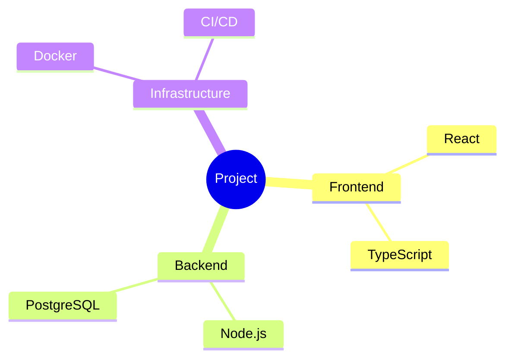

### Timeline
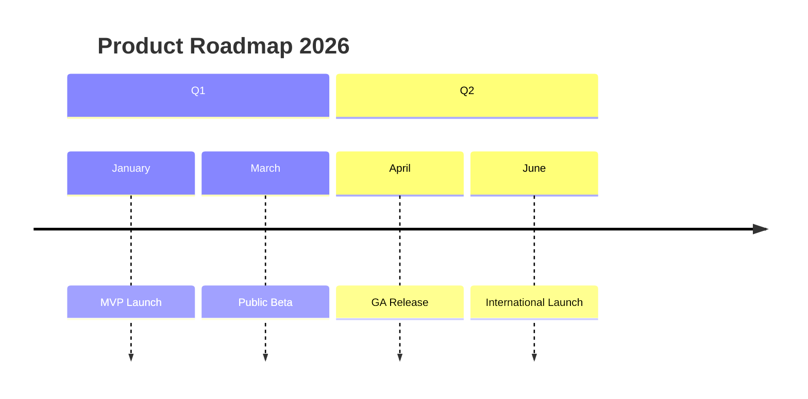

### Git Graph
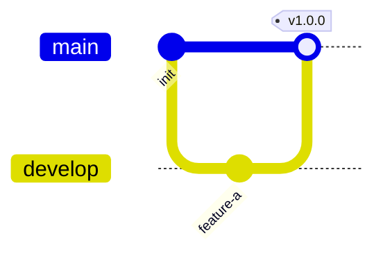

### Quadrant Chart
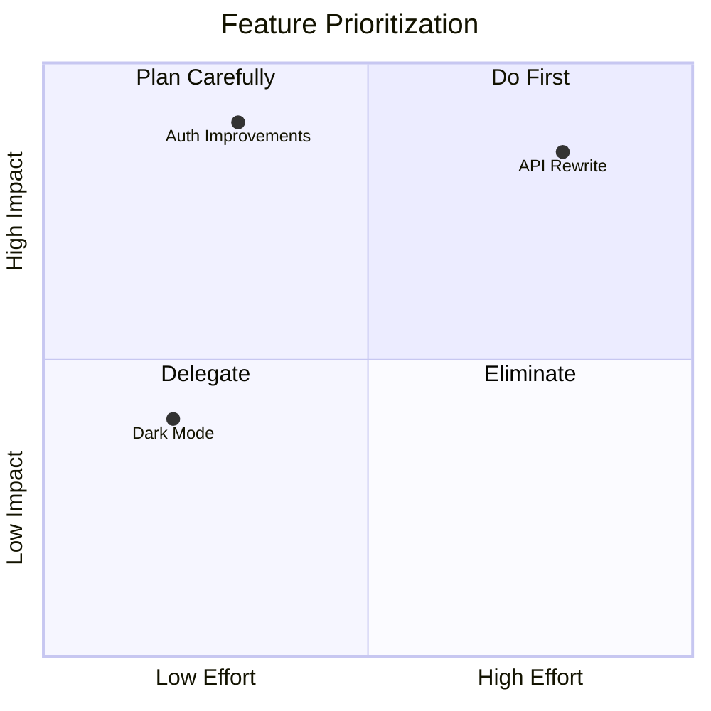

### C4 Context Diagram
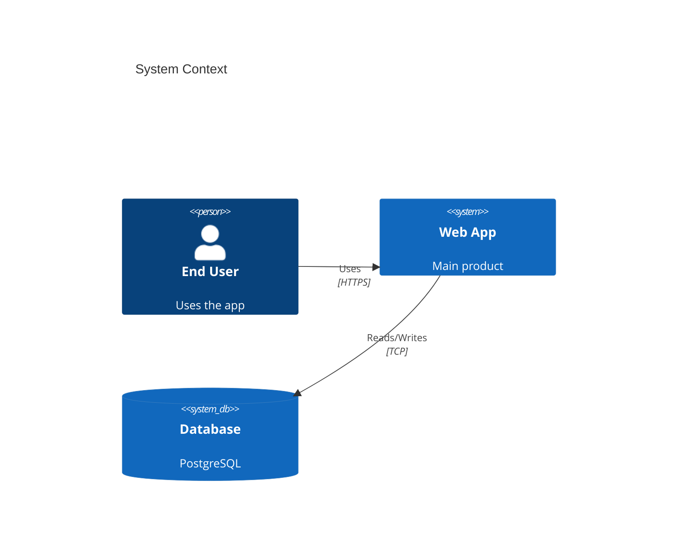

### XY Chart
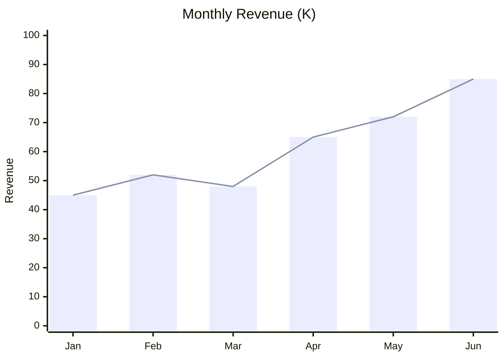

### Requirement Diagram
```mermaid
requirementDiagram
    requirement "User Auth" {
        id: REQ-001
        text: "Authenticate via OAuth 2.0"
        risk: medium
        verifymethod: test
    }
    element "Auth Service" {
        type: "software"
    }
    "Auth Service" - satisfies -> "User Auth"
```

### Sankey Diagram
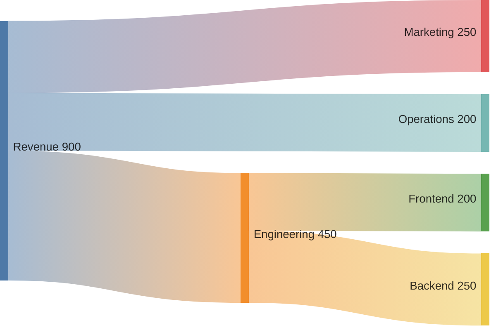

### Block Diagram (Beta)
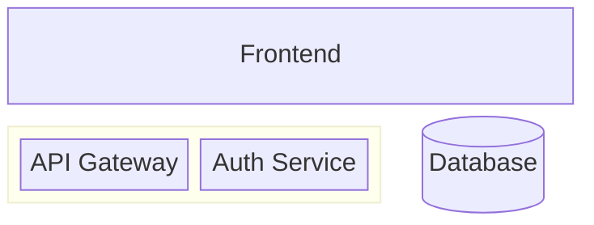

## Table Formatting

### Simple Table
```markdown
| Feature | Status | Notes |
|---------|--------|-------|
| Auth | Done | OAuth 2.0 |
| API | In Progress | REST endpoints |
| UI | Planned | React frontend |
```

### Wide Table
Keep total column widths reasonable. The builder wraps text within cells, but very wide tables may be compressed. Prefer 3-5 columns.

## Image Inclusion

```markdown

```

- Supported formats: PNG, JPG, JPEG, SVG
- Images are scaled to fit within page margins
- Place images in the Document Builder's `Assets/` directory or use absolute paths
- SVG images are converted to raster for PDF embedding

## Horizontal Rules and Page Breaks

A horizontal rule (`---`) creates a visual separator but does NOT force a page break when used within the document body (it only acts as front matter delimiters at the very start of the file).

To force a page break:
```markdown
<!-- pagebreak -->
```

## Text Formatting

Standard markdown inline formatting works:
- **Bold**: `**text**`
- *Italic*: `*text*`
- `Inline code`: `` `code` ``
- [Links](url): `[text](url)` - rendered in the accent color (default: `#3498db`)
- ~~Strikethrough~~: `~~text~~`

## Blockquotes

```markdown
> This is a blockquote. It will be rendered with a left border
> and slightly indented from the main text.
```
