# Mermaid Diagram Reference

All supported diagram types, when to use them, and syntax templates. The Document Builder renders mermaid diagrams locally via Playwright + Chromium.

## When to Create Diagrams

Proactively include mermaid diagrams when they communicate more effectively than text. Use them for:

- **Processes and workflows** - flowcharts, state diagrams
- **System architecture** - C4 context, class diagrams, block diagrams
- **Data relationships** - ER diagrams, class diagrams
- **Timelines and planning** - gantt charts, timelines
- **Comparisons and analysis** - quadrant charts, pie charts, XY charts
- **User experience** - journey maps, sequence diagrams
- **Project structure** - mindmaps, requirement diagrams
- **Version control flows** - git graphs
- **Resource flows** - sankey diagrams

Do NOT ask the user if they want a diagram. If the content benefits from visual representation, include it.

---

## Diagram Types

### 1. Flowchart

**Use when:** Showing processes, decision trees, workflows, algorithms, or any step-by-step logic with branching.

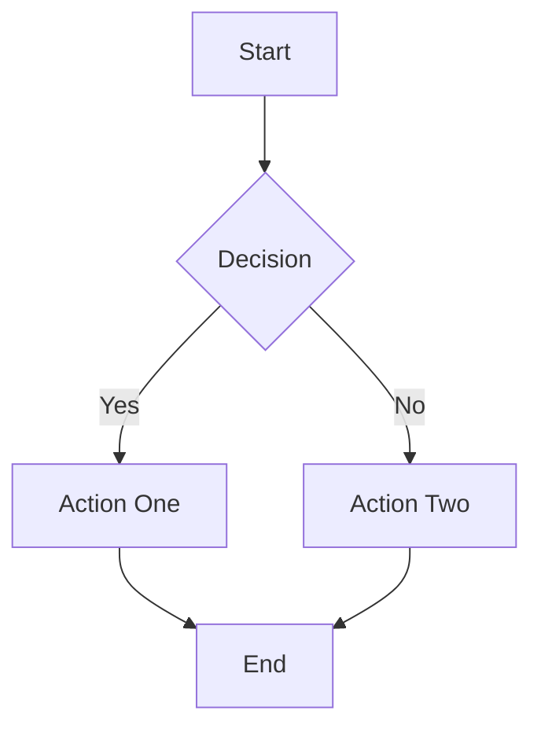

Directions: `TD` (top-down), `LR` (left-right), `TB` (top-bottom), `BT` (bottom-top), `RL` (right-left).

Node shapes:
- `[text]` rectangle
- `(text)` rounded
- `([text])` stadium
- `[[text]]` subroutine
- `[(text)]` cylinder/database
- `((text))` circle
- `{text}` rhombus/decision
- `{{text}}` hexagon
- `>text]` asymmetric/flag

Link types:
- `-->` solid arrow
- `---` solid line
- `-.->` dotted arrow
- `==>` thick arrow
- `-->|label|` arrow with label

Subgraphs group related nodes:
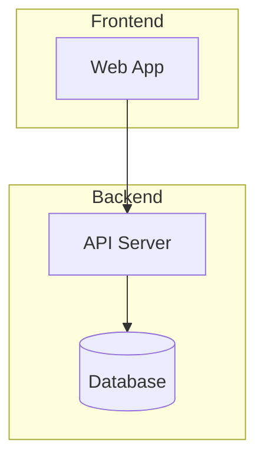

### 2. Sequence Diagram

**Use when:** Showing interactions between systems/actors over time, API flows, authentication sequences, or request-response patterns.

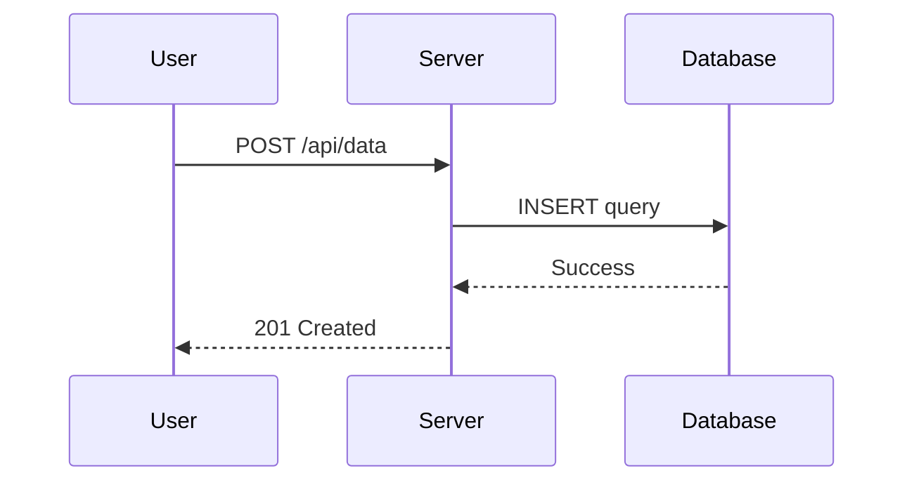

Arrow types:
- `->>` synchronous (solid)
- `-->>` return/response (dashed)
- `-)` async (open arrow)

Blocks:
- `loop` - repeating actions
- `alt` / `else` - conditional branches
- `opt` - optional actions
- `par` - parallel execution
- `Note over A,B: text` - annotations

### 3. State Diagram

**Use when:** Modeling object lifecycles, status transitions, FSMs, or any entity with distinct states and transitions between them.

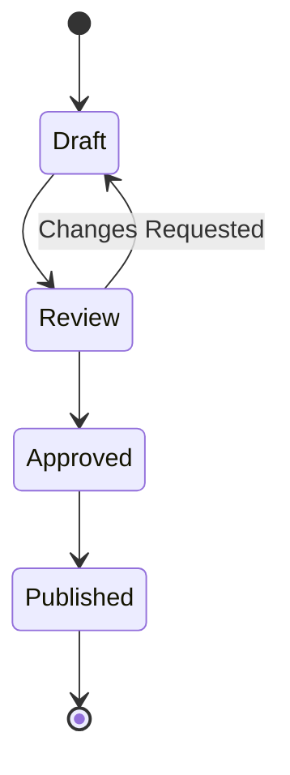

Features:
- `[*]` for start/end states
- `state "Name" as alias` for long names
- Composite states with nested `state Parent { ... }`
- `<<choice>>` for decision points
- `--` separator for concurrent regions

### 4. Class Diagram

**Use when:** Documenting object-oriented design, API data models, type hierarchies, or interface contracts.

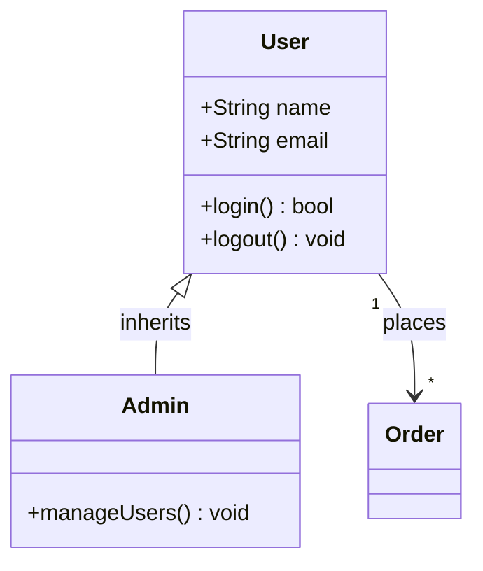

Visibility: `+` public, `-` private, `#` protected.

Relationships:
- `<|--` inheritance
- `*--` composition
- `o--` aggregation
- `-->` association
- `..>` dependency

Stereotypes: `<<interface>>`, `<<abstract>>`, `<<service>>`.

### 5. Entity Relationship Diagram

**Use when:** Documenting database schemas, data models, or entity relationships with cardinality.

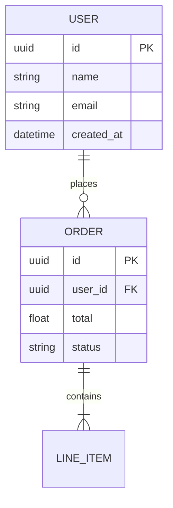

Cardinality:
- `||--||` one-to-one
- `||--o{` one-to-many
- `}o--||` many-to-one
- `}o--o{` many-to-many

### 6. Gantt Chart

**Use when:** Project timelines, sprint planning, release schedules, or any time-based task breakdown.

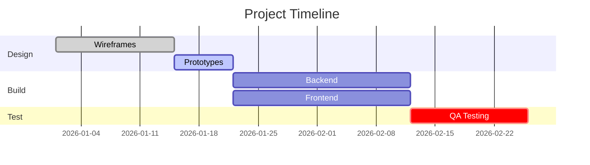

Task states: `done`, `active`, `crit` (critical path). Use `after taskId` for dependencies. Milestones are 0-duration tasks.

### 7. Pie Chart

**Use when:** Showing proportional breakdowns, market share, resource allocation, or survey results.

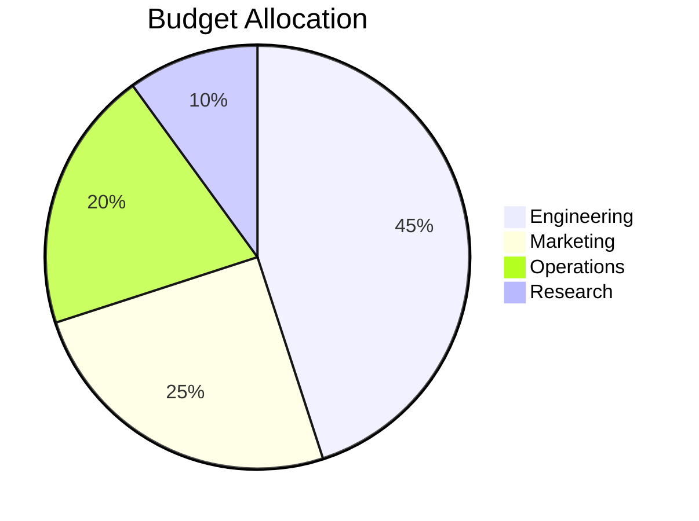

### 8. Git Graph

**Use when:** Illustrating branching strategies, release workflows, or explaining git history.

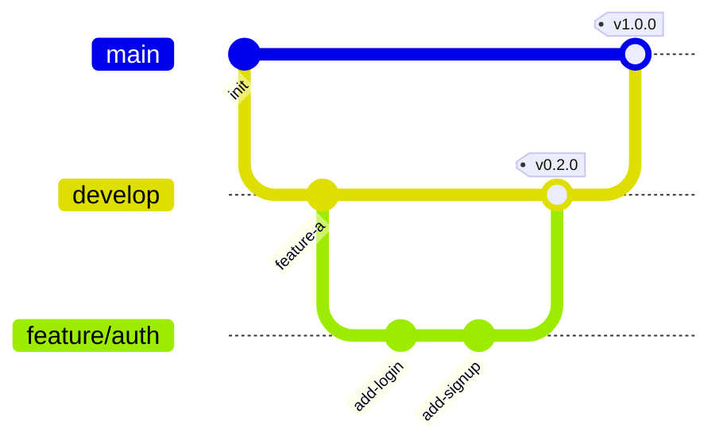

### 9. Mindmap

**Use when:** Brainstorming, topic exploration, concept mapping, feature breakdowns, or hierarchical idea organization.

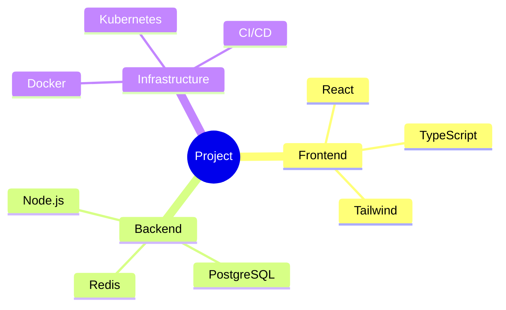

### 10. Timeline

**Use when:** Historical overviews, roadmaps, milestone tracking, or chronological event sequences.

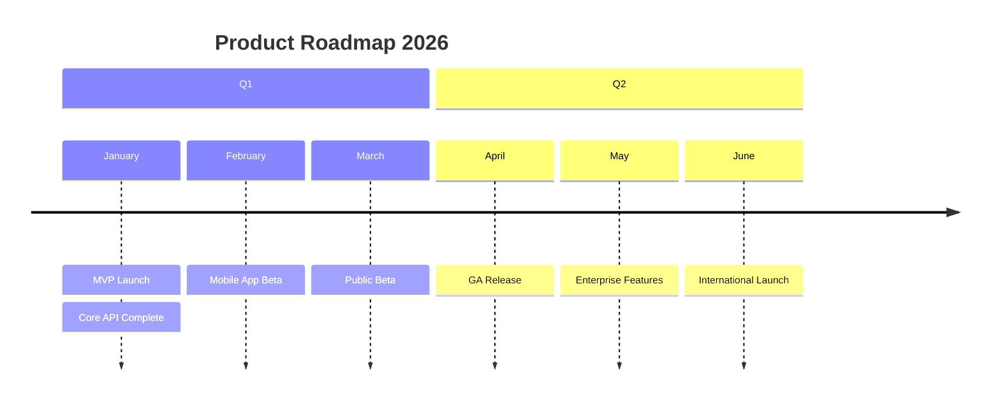

### 11. User Journey

**Use when:** Mapping user experience flows, identifying pain points, onboarding sequences, or customer satisfaction analysis.

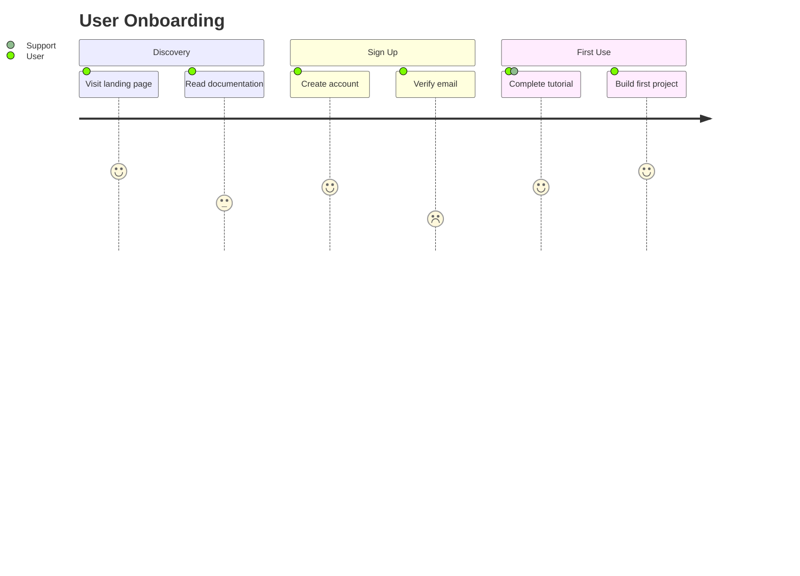

Scores range from 1 (frustrating) to 5 (delightful). Multiple actors can be listed per task.

### 12. Quadrant Chart

**Use when:** Prioritization matrices (effort vs impact), competitive analysis, risk assessment, or any two-axis comparison.

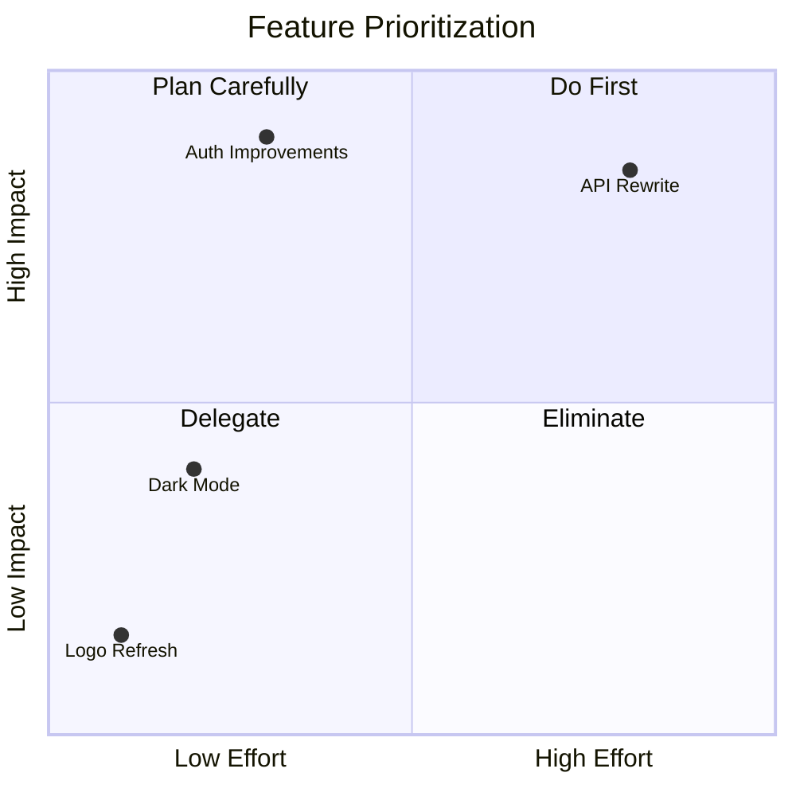

### 13. C4 Context Diagram

**Use when:** High-level system architecture showing users, systems, and their interactions. Ideal for architecture documentation and system overviews.

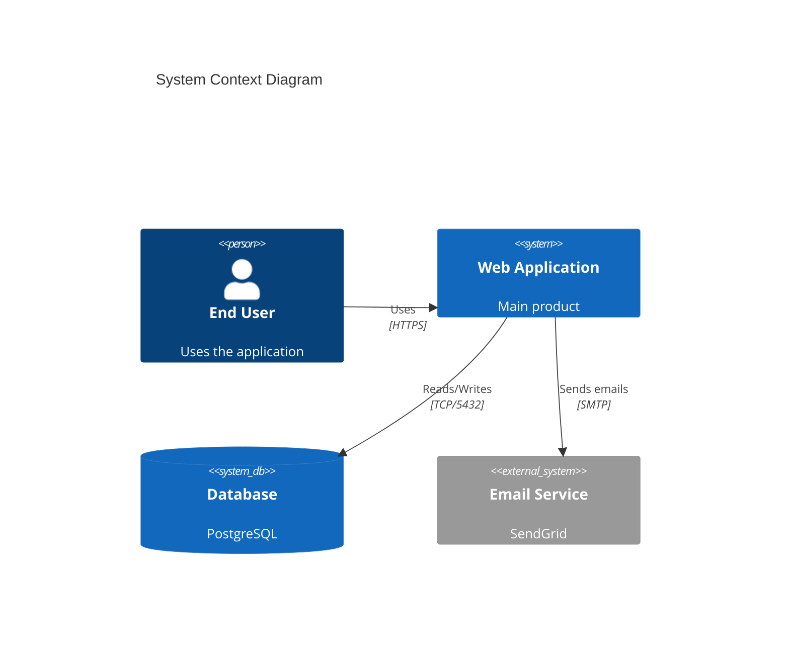

Elements: `Person`, `System`, `SystemDb`, `SystemQueue`, `System_Ext`, `Boundary`.

### 14. XY Chart

**Use when:** Plotting numerical data, performance metrics over time, benchmarks, or any line/bar chart visualization.

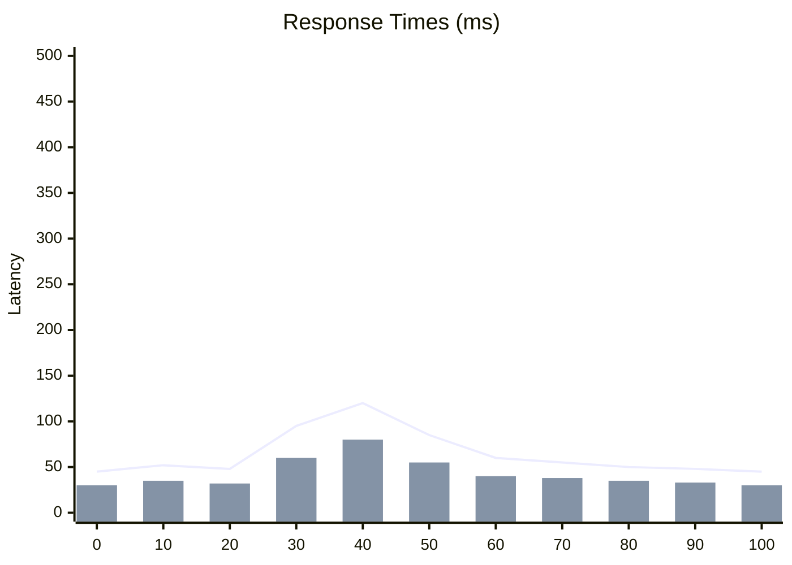

### 15. Requirement Diagram

**Use when:** Documenting system requirements, traceability matrices, or showing how requirements relate to components.

```mermaid
requirementDiagram
    requirement "User Authentication" {
        id: REQ-001
        text: "System shall authenticate users via OAuth 2.0"
        risk: medium
        verifymethod: test
    }
    functionalRequirement "Session Management" {
        id: REQ-002
        text: "Sessions expire after 30 minutes of inactivity"
        risk: low
        verifymethod: test
    }
    element "Auth Service" {
        type: "software"
        docRef: "auth-service-v2"
    }
    "Auth Service" - satisfies -> "User Authentication"
    "Session Management" - derives -> "User Authentication"
```

Requirement types: `requirement`, `functionalRequirement`, `performanceRequirement`, `interfaceRequirement`.
Relationships: `satisfies`, `derives`, `traces`, `contains`, `refines`, `copies`, `verifies`.

### 16. Sankey Diagram

**Use when:** Visualizing resource flows, energy distribution, budget allocation flows, or data pipeline throughput.

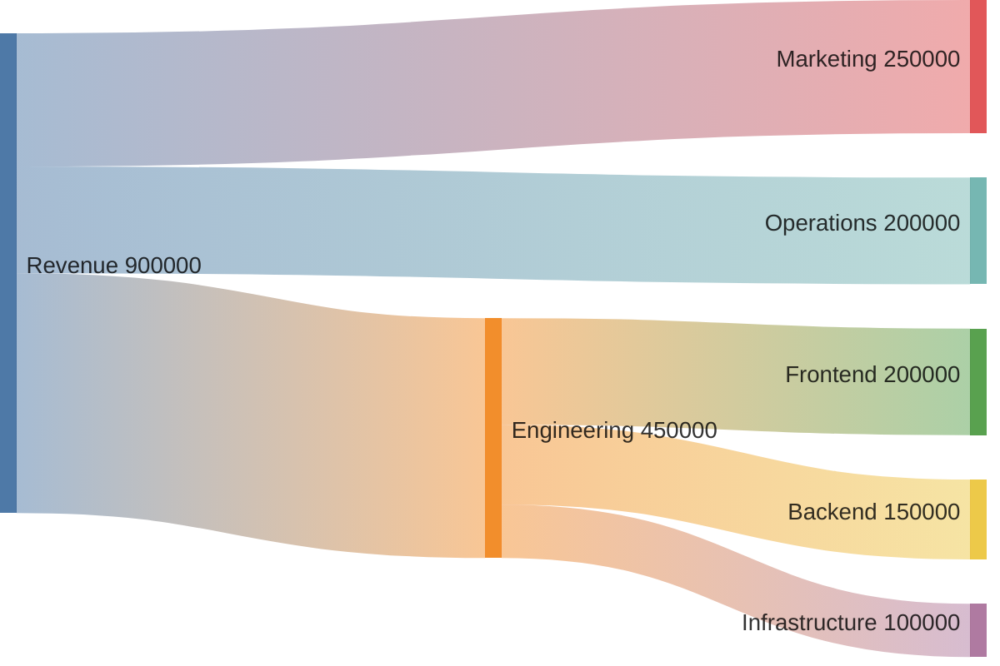

### 17. Block Diagram (Beta)

**Use when:** System block diagrams, hardware architecture, or component layouts with spatial arrangement.

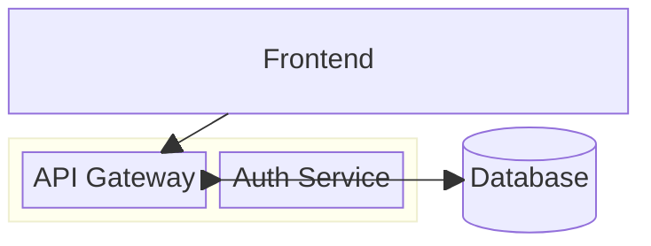

---

## Syntax Rules

1. **Labels under 80 characters** - use `<br>` for line breaks within nodes
2. **Avoid special characters** in labels: `"`, `<`, `>`, `{`, `}` - use parentheses or brackets instead
3. **No double-arrow edge labels** - use single direction arrows with labels
4. **No spaces before pipe** in arrow labels - `-->|label|` not `--> |label|`
5. **Theme is set in config.yaml** - do not use `%%{init:...}%%` directives (the builder handles theming)
6. **Fallback behavior** - if rendering fails, the builder shows the diagram as a code block (configurable)

## Choosing the Right Diagram

| Need | Diagram Type |
|------|-------------|
| Process with decisions | Flowchart |
| API/system interactions over time | Sequence |
| Object/entity lifecycle | State |
| OOP design, type hierarchy | Class |
| Database schema | ER |
| Project schedule | Gantt |
| Proportional breakdown | Pie |
| Branching/release strategy | Git Graph |
| Brainstorm/concept map | Mindmap |
| Chronological milestones | Timeline |
| UX flow with satisfaction | Journey |
| Priority/comparison matrix | Quadrant |
| High-level architecture | C4 Context |
| Numerical data plots | XY Chart |
| Formal requirements | Requirement |
| Resource/data flows | Sankey |
| Component spatial layout | Block |
